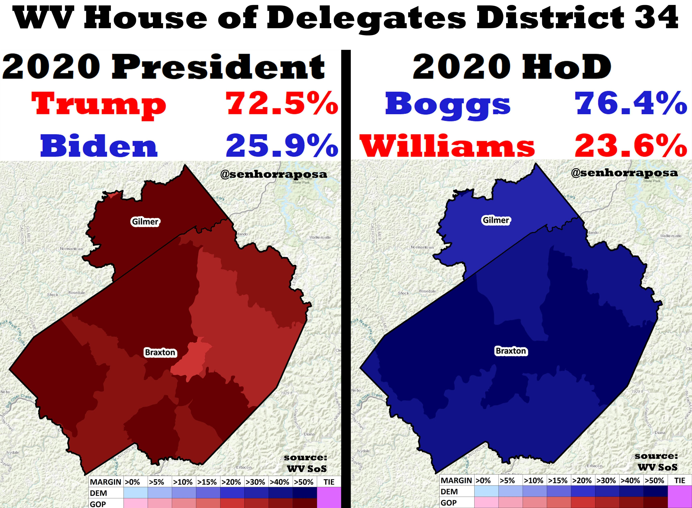

---
title: Case Study One
layout: default
filename: caseOne
--- 

# Case Study One: The Tale of West Virginia

In the heart of West Virginia lies Braxton County, a small county with a population of approximately 14,000 people. Like most of West Virginia, its economy and social spheres are based strongly on the coal mining industry. Politically, it had been strongly Democratic for a century: From 1900 to 2008, it had voted for the Democratic presidential nominee in every election save two (the 1920 and 1972 Republican landslides). But in 2012, it turned red and gave Mitt Romney 57% of the vote, and rapidly shifted to the right, giving Trump 69% of the vote in 2016 and then 73% in 2020.¹ 

The 34th District in the West Virginia House of Delegates is composed of the entirety of Braxton County and a small slice of neighboring Gilmer County. And for the past 24 years, Democrat Brent Boggs has filled the seat, four of them as House Majority leader from 2009 - 2013.

Amazingly, in 2016, as Donald Trump cruised to a landslide 70%-26% victory in District 34, Delegate Boggs ran unopposed. Then, in 2018, he beat back a Republican challenger 74%-26%. Indeed, in 2018, Boggs was the Democratic state legislative candidate who overperformed Hillary Clinton the most -- a whopping 48% improvement over her vote share! 

And again, in 2020, as Trump secured another huge 72.5% victory in the district, Boggs crushed his Republican opponent 76.4% - 23.6%.² Although monocolored, the following map displays his significant electoral prowess in this age of polarization:³

It may not come as a surprise to scholars of state politics that Boggs is not a cookie-cutter liberal Democrat. Socially conservative, Boggs has been endorsed by the NRA (with a 100% score) and West Virginians for Life (with an 87% score). However, that social conservatism belies strong labor support. In union, labor, and worker's issues, Boggs is aligned with the bread-and-butter of the Democratic party, receiving various union endorsements such as the WV AFL-CIO (with an 89% score) and the International Brotherhood of Teamsters.⁴

A railroad workers' union leader before entering politics, Boggs described himself in 2000 to _Traffic World_, a transportation journal:

**"[I'm] not your typical Democrat. I'm endorsed by the National Rifle Association and West Virginia Farm Bureau and I'm fiscally and morally conservative, reflecting the views of working people in my district. My votes are very much in tune with the needs and wants of working families, most of whom are just one serious accident or illness away from economic devastation."⁵**

Bogg's overwhelming 2020 victory came as Democrats simultaneously lost 18 seats in the West Virginia House of Delegates, reducing themselves to a superminority of 24 out of 100.⁶ 

This can be seen as one part of an increasing "downballot realignment" across the US. For example, West Virginia's longtime state treasurer John Perdue -- a Democrat elected for six terms, all with large margins -- lost his bid for a seventh term by 13% to his Republican challenger this year.⁷

So how did Delegate Boggs escape the fate of Treasurer Perdue? The classic formula applies: combining strong union support with social conservatism can be a winning combination in these sorts of districts. 

Of course, it wouldn't surprise me if Delegate Boggs fell victim to the tide of polarization within the next decade. But his success in spite of it has been remarkable, and could be a path for Democrats to attempt to claw back some of their losses in rural, working-class areas across the country.

### Works Cited & Notes

¹ Leip, David. "Dave Leip's Atlas of U.S. Presidential Elections". uselectionatlas.org.

² Ballotpedia, [West Virginia House of Delegates District 34.](https://ballotpedia.org/West_Virginia_House_of_Delegates_District_34)

³ Savicki, Drew. Originally sourced from West Virginia Secretary of State. [Tweet.](https://twitter.com/SenhorRaposa/status/1333164710984896514?s=20)

⁴ VoteSmart, [Brent Boggs Ratings.](https://justfacts.votesmart.org/candidate/evaluations/10646/brent-boggs)

⁵ Wilner, Frank N. "Labor's Farm System." _Traffic World_ 264, no. 10 (Dec 04, 2000): 13-14. [ProQuest link.](https://search-proquest-com.ezproxy2.williams.edu/trade-journals/labors-farm-system/docview/195693547/se-2?accountid=15054.)

⁶ Ballotpedia, [West Virginia House of Delegates Elections 2020.](https://ballotpedia.org/West_Virginia_House_of_Delegates_elections,_2020)

⁷ Brad McElhinny, ["Riley Moore knocks off 6-term Treasurer John Perdue, leading GOP sweep of executive offices,"](https://wvmetronews.com/2020/11/03/attorney-general-and-auditor-races-called-for-incumbents/) West Virginia Metro News, 2020.

