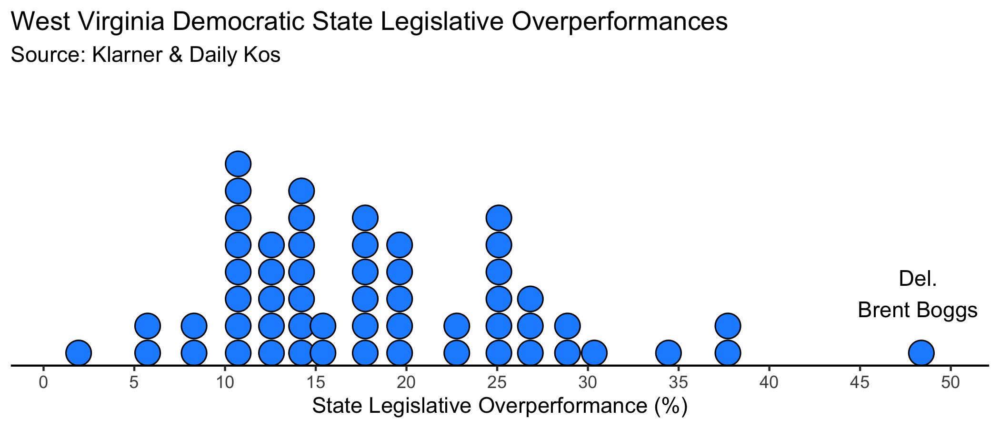
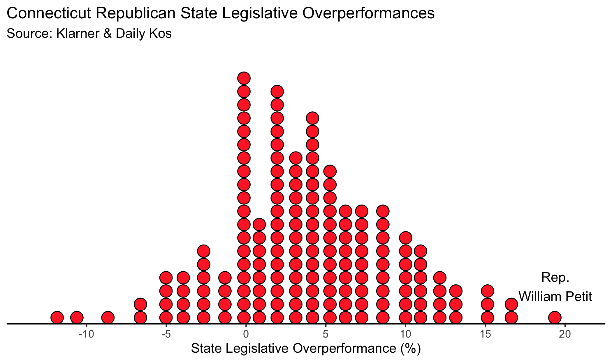

---
title: Conclusion
layout: default
filename: conclusion
--- 

# Conclusion

Something has been brewing in the 99 state legislative chambers across the United States. The rapid polarization of the election of their members has led us into a new era of state government. Depending on your perspective, this era could breed a wealth of partisan gridlock or an outgrowth of responsiveness to national issues at the state level.

However, we've not reached the event horizon yet -- vestiges of a less nationalized era still remain. 

In **Case Study One**, we saw the case of Delegate Brent Boggs in West Virginia, whose socially conservative and pro-union stances gave him the distinction of being the Democrat to overperform Hillary Clinton the most in 2018. 

In **Case Study Two**, we looked at Representative William Petit of Connecticut, whose family tragedy and subsequent advocacy allowed him to secure a strong perch in a swing district, and to cultivate a reputation for moderation, compromise, and effectiveness. 

Not coincidentally, both men were the most overperforming candidate of their party in their state. See the following dot plots:

Indeed, the great electoral performances of these two legislators can give us some insight into how both parties can cut through the tide of polarization at the state legislative level.

For Del. Boggs, one lesson for Democrats -- who constantly wrestle between their progressive base and moderate faction -- is that it _can_ be effective to compromise on social issues to win culturally conservative voters in Trump districts. As the data showed, 70% of Democratic state legislative candidates who overperformed Clinton by 10% or more were in Trump states. 

For Rep. Petit, a key finding for Republicans -- who also are consistently engaged in a tug-of-war between the firebreathing conservatives and the more conciliatory moderates, at least at the state level -- is that one path to reclaiming seats in the Northeast is to cultivate personal brands and support the policies of good government. This is borne out by the data: 74% of Republican state legislative candidates who overperformed Trump by 10% or more were in Clinton states. 

Where could we go from here? The marching tide of polarization has trickled down to the state legislatures, despite some high-profile **Exceptions** that I've highlighted. Some argue that the way forward, to cut through polarization, is through reform at the state level -- such as sending voters sample ballots and information pamphlets.¹ Others offer that the bully pulpit of the Presidency could be wielded to the maximum effect by accelerating polarization through a nationalization of these elections. In its own way, this could pave the way for periods of one-party governance that seeks to minimize partisan gridlock.²

It's easy to dismiss the polarization of state legislatures as irreversible and all-encompassing, and to remain despondent about the future of our country. But in the world of politics, nothing is forever -- where is the Whig Party or the Solid South? The tales of Del. Boggs and Rep. Petit, and their recent electoral successes, demonstrate that there is still a path forward. Tip O'Neill's maxim that "all politics is local" may not apply anymore, but we haven't reached "all politics is national" yet either. 

### Works Cited & Notes

¹ Melusky, Benjamin and Jesse Richman. (2020) "When the local is national – A new high-water mark for nationalization in the 2018 United States state legislative elections", _Regional & Federal Studies_, 30:3, pg. 455.

² Rogers, Steven. "National forces in state legislative elections." _The ANNALS of the American Academy of Political and Social Science_ 667, no. 1 (2016): pg. 220
