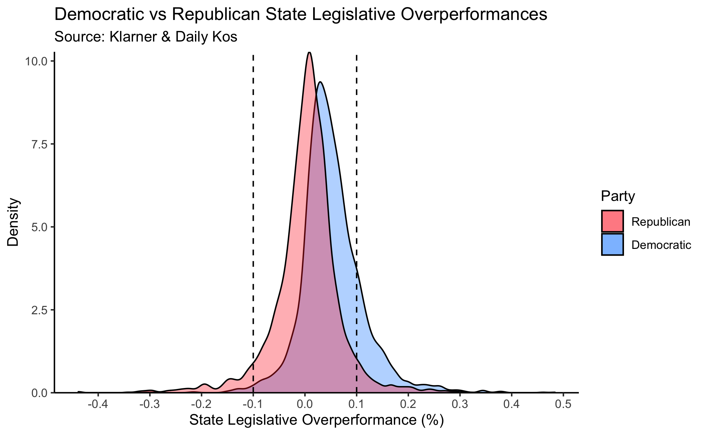

---
title: Exceptions
layout: default
filename: exceptions
--- 

# Exceptions

To begin, the following table shows summary statistics from the distributions of both party's state legislative candidate overperformances: 

Party | Min | Median | Mean | Max
--- | ---|---|---|---|
Republican | -0.44|0.007|0.004|0.32
Democratic| -0.3|0.04|0.05|0.48 

 
Interestingly, both the mean and median of both party's distributions are positive, indicating that on average, a state legislative candidate will outrun their Presidential standard bearer, if just by a little bit.

And picking up from the **Introduction** tab, in evaluating the 13% of state legislative candidates who ran 10% or more ahead or behind of their party, it is useful to distinguish between Democrats and Republicans. Does one party run ahead of or behind their Presidential candidate more often in the aggregate? The answer, it turns out, is yes. The following density plot shows state legislative over / under performance, shaded by party, with lines to represent the 10% thresholds:

As one can see from the plot, a greater proportion of Republicans fall within the 10% gates than Democrats. To be exact, 83% of Democrats fall within the 10% limits vs. 91% of Republicans. And of those 17% of Democrats that don't fall within those limits, as the graph shows, 96% had an overperformance greater than 10% over Hillary Clinton, while just 4% were big underperformers. And of the 9% of Republicans who did better or worse than 10%, only 48% were overperformers, with the other 52% performing more than 10 points worse than Donald Trump.

All together, we can see that a state legislative candidate's over or under performance is indeed affected by party, with Democratic state legislative candidates overperforming on average more than their Republican counterparts. What could be the cause?

Digging a little further into the distribution of the 17% of Democrats who were big over/underperformers among state legislative candidates yields another valuable source of stratification. It turns out that the vast majority of Democratic overperformers are in states won by Donald Trump, and conversely, the vast majority of underperformers are in states won by Hillary Clinton. The following table summarizes this observation:

2016 Winner Statewide¹ | Performance vs. Hillary Clinton| Count | Percentage
--- | ---|---|---|
Trump | > 10% Overperform |358|0.70
Clinton | > 10% Overperform |155|0.30
Clinton | > 10% Underperform |18|0.82
Trump | > 10% Underperform |4|0.18

The fact many Democrats were able to significantly overperform Clinton in Trump states, and also that many were able to substantially underperform her in strong blue states, is indicative that Presidential coattails do not explain all state legislative elections, and that some local issues still matter.

In **Case Study One**, we'll take a look at the first case, that of a downballot Democrat running far ahead of Clinton in very Trumpy West Virginia.

In **Case Study Two**, we'll examine the second case, that of Republican who managed to outperform Trump by a great deal in true blue Connecticut.

### Works Cited & Notes

Information on data collection can be found in the **Methodology** tab.

¹ Maine split its electoral votes 3-1, but it is counted here as a Clinton state as she won statewide. 